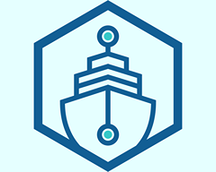

<div id="top"></div>
<!--
*** Thanks for checking out the Best-README-Template. If you have a suggestion
*** that would make this better, please fork the repo and create a pull request
*** or simply open an issue with the tag "enhancement".
*** Don't forget to give the project a star!
*** Thanks again! Now go create something AMAZING! :D
-->

<!-- PROJECT SHIELDS -->
<!--
*** I'm using markdown "reference style" links for readability.
*** Reference links are enclosed in brackets [ ] instead of parentheses ( ).
*** See the bottom of this document for the declaration of the reference variables
*** for contributors-url, forks-url, etc. This is an optional, concise syntax you may use.
*** https://www.markdownguide.org/basic-syntax/#reference-style-links
-->
[![Contributors][contributors-shield]][contributors-url]
[![Forks][forks-shield]][forks-url]
[![Stargazers][stars-shield]][stars-url]
[![Issues][issues-shield]][issues-url]
[![MIT License][license-shield]][license-url]
[![LinkedIn][linkedin-shield]][linkedin-url]

<!-- PROJECT LOGO -->
<br />
<div align="center">
  <a href="https://github.com/drobb2020/django-2021">
    
  </a>

  <h3 align="center">Django-2021</h3>

  <p align="center">
    A Udemy course by Dennis Ivy. This is a great beginners Django project, and teaches many topics to become proficient with Django development.
    <br />
    <a href="https://github.com/drobb2020/django-2021"><strong>Explore the docs »</strong></a>
    <br />
    <br />
    <a href="https://github.com/drobb2020/django-2021">View Demo</a>
    ·
    <a href="https://github.com/drobb2020/django-2021/issues">Report Bug</a>
    ·
    <a href="https://github.com/drobb2020/django-2021/issues">Request Feature</a>
  </p>
</div>

<!-- TABLE OF CONTENTS -->
<details>
  <summary>Table of Contents</summary>
  <ol>
    <li>
      <a href="#about-the-project">About The Project</a>
      <ul>
        <li><a href="#built-with">Built With</a></li>
      </ul>
    </li>
    <li>
      <a href="#getting-started">Getting Started</a>
      <ul>
        <li><a href="#prerequisites">Prerequisites</a></li>
        <li><a href="#installation">Installation</a></li>
      </ul>
    </li>
    <li><a href="#usage">Usage</a></li>
    <li><a href="#roadmap">Roadmap</a></li>
    <li><a href="#contributing">Contributing</a></li>
    <li><a href="#license">License</a></li>
    <li><a href="#contact">Contact</a></li>
    <li><a href="#acknowledgments">Acknowledgments</a></li>
  </ol>
</details>

<!-- ABOUT THE PROJECT -->
## About The Project

[![Product Name Screen Shot][product-screenshot]](https://example.com)

This is a great way to showcase your projects, as well as allowing other to join and share their projects. Along with that you can also highlight your own skills and biography. Maybe it will help you land a job.

<p align="right">(<a href="#top">back to top</a>)</p>

### Built With

This section should list any major frameworks/libraries used to bootstrap your project. Leave any add-ons/plugins for the acknowledgements section. Here are a few examples.

* [Python](https://python.org)
* [Django](https://www.djangoproject.com/)
* [Django-Rest-Framework](https://www.django-rest-framework.org/)
* [HTML](https://www.w3schools.com/html/)
* [JavaScript](https://www.javascript.com/)

<p align="right">(<a href="#top">back to top</a>)</p>

<!-- GETTING STARTED -->
## Getting Started

To complete this project you will need python 3.6 or above. This code was built using python 3.10.8. After getting python installed you should create a virtual environment to store the project specific modules.

### Prerequisites

This is an example of how to list things you need to use the software and how to install them.

* Python Virtual Environment

  ```sh
  mkdir django-2021
  cd django-2021
  python -m venv venv
  source venv/bin/activate (macos)
  venv/Scripts/activate (windows)
  ```

### Installation

_Below is an example of how you can instruct your audience on installing and setting up your app. This template doesn't rely on any external dependencies or services._

1. Clone the repo

   ```sh
   git clone https://github.com/drobb2020/django-2021.git
   ```

2. Install the necessary python packages

   ```sh
    pip install -r requirements.txt
   ```

3. Run the project with

   ```sh
   python manage.py runserver
   ```

<p align="right">(<a href="#top">back to top</a>)</p>

<!-- USAGE EXAMPLES -->
## Usage

This django application is designed as place where developers can get together, share ideas, and showcase their work. It includes the ability of members to message each other inside the application.

_For more examples, please refer to the [Documentation](https://github.com/drobb2020/django-2021/issues)_

<p align="right">(<a href="#top">back to top</a>)</p>

<!-- ROADMAP -->
## Roadmap

* Add HTMX to the project
* Add Alpine.js to the project

See the [open issues](https://github.com/drobb2020/django-2021/issues) for a full list of proposed features (and known issues).

<p align="right">(<a href="#top">back to top</a>)</p>

<!-- CONTRIBUTING -->
## Contributing

Contributions are what make the open source community such an amazing place to learn, inspire, and create. Any contributions you make are **greatly appreciated**.

If you have a suggestion that would make this better, please fork the repo and create a pull request. You can also simply open an issue with the tag "enhancement".
Don't forget to give the project a star! Thanks again!

1. Fork the Project
2. Create your Feature Branch (`git checkout -b feature/AmazingFeature`)
3. Commit your Changes (`git commit -m 'Add some AmazingFeature'`)
4. Push to the Branch (`git push origin feature/AmazingFeature`)
5. Open a Pull Request

<p align="right">(<a href="#top">back to top</a>)</p>

<!-- LICENSE -->
## License

Distributed under the MIT License. See `LICENSE.txt` for more information.

<p align="right">(<a href="#top">back to top</a>)</p>

<!-- CONTACT -->
## Contact

Your Name - [@davidrobb2](https://twitter.com/davidrobb2) - drobb2011@gmail.com

Project Link: [https://github.com/drobb2020/django-2021](https://github.com/drobb2020/django-2021)

<p align="right">(<a href="#top">back to top</a>)</p>

<!-- ACKNOWLEDGMENTS -->
## Acknowledgments

Hats off to Dennis Ivy for an outstanding tutorial. I learned a lot from this project that I will be able to incorporate into future django projects.

* [Choose an Open Source License](https://choosealicense.com)
* [Img Shields](https://shields.io)
* [GitHub Pages](https://pages.github.com)
* [Font Awesome](https://fontawesome.com)

<p align="right">(<a href="#top">back to top</a>)</p>

<!-- MARKDOWN LINKS & IMAGES -->
<!-- https://www.markdownguide.org/basic-syntax/#reference-style-links -->
[contributors-shield]: https://img.shields.io/github/contributors/drobb2020/django-2021.svg?style=for-the-badge
[contributors-url]: https://github.com/drobb2020/django-2021/graphs/contributors
[forks-shield]: https://img.shields.io/github/forks/drobb2020/django-2021.svg?style=for-the-badge
[forks-url]: https://github.com/drobb2020/django-2021/network/members
[stars-shield]: https://img.shields.io/github/stars/drobb2020/django-2021.svg?style=for-the-badge
[stars-url]: https://github.com/drobb2020/django-2021/stargazers
[issues-shield]: https://img.shields.io/github/issues/drobb2020/django-2021.svg?style=for-the-badge
[issues-url]: https://github.com/drobb2020/django-2021/issues
[license-shield]: https://img.shields.io/github/license/drobb2020/django-2021.svg?style=for-the-badge
[license-url]: https://github.com/drobb2020/django-2021/blob/master/LICENSE.txt
[linkedin-shield]: https://img.shields.io/badge/-LinkedIn-black.svg?style=for-the-badge&logo=linkedin&colorB=555
[linkedin-url]: https://linkedin.com/in/othneildrew
[product-screenshot]: static/assets/screenshot.png
